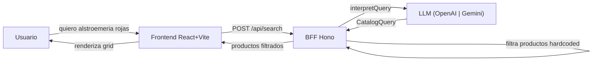

# Buscador de Catalogo de Flores con Lenguaje Natural

## Analisis de la estructura de datos

De los 64 productos, se extraen estas dimensiones filtrables:

- **category** (6 valores): African, Agapanthus, Allium, Alstro, Amaranthus, Anemone
- **color** (15 valores): Green, Blue, White, Purple, Assorted, Hot Pink, Lavender, Orange, Orange Red, Peach, Pink, Pink Hot, Pink Light, Red, Yellow
- **origin** (6 valores): MIA, SJO, NL, MDE, UIO, BOG
- **unitType** (2 valores): Stem, Bunch
- **box** (5 valores): QB, VM8, EB, SB, Q
- **quality**: A1 (uniforme, no filtrable)
- **name**: Texto libre con variedad + tamanio (ej. "70 cm", "90 cm")

## Arquitectura



### Frontend (`app/frontend/`)

- **React 19 + Vite + TypeScript + TailwindCSS + shadcn/ui**
- Componente `NaturalSearchBar`: input con estilo similar al `SearchBarChip` de open-discovery pero con indicador de "AI-powered"
- `ProductGrid` + `ProductCard`: grid de productos reutilizando el look del screenshot de Allure Farms
- `FilterChips`: badges que muestran la interpretacion del LLM (ej. "Category: Alstro", "Color: Red") con opcion de remover
- Los 64 productos quedan como data estatica en el frontend tambien para fallback

### BFF (`app/bff/`)

- **Hono + TypeScript** (alineado con open-discovery BFF)
- Endpoint `POST /api/search` que recibe `{ query: string }`
- **Proveedor de LLM configurable**: el BFF depende de la interfaz `ICatalogLLMProvider`; un factory elige la implementacion (OpenAI o Gemini) segun `LLM_PROVIDER`. Ver seccion [Proveedor de LLM configurable](#proveedor-de-llm-configurable-opcion-1).
- Los 64 productos hardcoded en el BFF, se filtran server-side y se devuelven
- Las API keys quedan en el servidor via `.env` (solo se cargan las del proveedor elegido)

### Schema de salida del LLM (CatalogQuery)

```typescript
interface CatalogQuery {
  categories?: string[]; // e.g. ["Alstro"]
  colors?: string[]; // e.g. ["Red", "Pink Hot"]
  origins?: string[]; // e.g. ["MIA", "BOG"]
  nameContains?: string; // e.g. "90 cm"
  unitType?: string; // "Stem" | "Bunch"
  box?: string; // e.g. "QB"
}
```

### System prompt (compartido por todos los proveedores)

Se incluye:

- Lista exhaustiva de valores validos por dimension (extraidos de los 64 productos)
- Instrucciones para interpretar lenguaje natural en espaniol e ingles
- Mapeo de sinonimos comunes del dominio floral (ej. "alstroemeria" -> category "Alstro", "colombia" -> origin "BOG"/"MDE", "rosa" -> color "Pink" o "Pink Hot")
- Indicacion de devolver `{}` (sin filtros) si la query no es interpretable

### Proveedor de LLM configurable (opción 1)

El BFF usa **interfaz + factory** para poder cambiar de LLM por configuracion sin tocar la ruta de busqueda.

- **Interfaz** `ICatalogLLMProvider`: un unico metodo `interpretQuery(userQuery: string): Promise<CatalogQuery>`. Todas las implementaciones devuelven el mismo tipo.
- **Implementaciones**:
  - **OpenAIProvider**: usa `openai` SDK con `response_format: { type: "json_schema", json_schema: ... }` para salida estructurada.
  - **GeminiProvider**: usa `@google/generative-ai` (Google AI Studio, API key en [aistudio.google.com](https://aistudio.google.com/)); como Gemini no tiene json_schema nativo, se usa prompt que pide JSON valido y parseo (con validacion Zod opcional) o JSON mode si esta disponible.
- **Factory** `getCatalogLLMProvider()`: lee `LLM_PROVIDER` (y API keys) de env y devuelve la instancia correspondiente. La ruta `POST /api/search` solo llama a `provider.interpretQuery(body.query)`.
- **Variables de entorno**:
  - `LLM_PROVIDER`: `openai` | `gemini` (obligatorio para que el BFF arranque con un proveedor valido).
  - `OPENAI_API_KEY`: requerido si `LLM_PROVIDER=openai`.
  - `GEMINI_API_KEY` (o `GOOGLE_AI_API_KEY`): requerido si `LLM_PROVIDER=gemini`.
- **Modelos sugeridos**: OpenAI `gpt-4o-mini`; Gemini `gemini-1.5-flash` o `gemini-1.5-pro`.

## Estructura de archivos

```
ai-adoption-workshop/app/
  package.json           # npm workspaces root
  frontend/
    package.json
    vite.config.ts
    tailwind.config.js
    src/
      main.tsx
      App.tsx
      components/
        NaturalSearchBar.tsx
        ProductGrid.tsx
        ProductCard.tsx
        FilterChips.tsx
      data/
        products.ts       # 64 productos hardcoded
      types/
        product.ts
        search.ts
      services/
        searchApi.ts      # cliente HTTP al BFF
  bff/
    package.json
    tsconfig.json
    src/
      index.ts            # servidor Hono
      routes/
        search.ts         # POST /api/search (usa getCatalogLLMProvider())
      services/
        llm/
          types.ts        # CatalogQuery, ICatalogLLMProvider
          openai.provider.ts
          gemini.provider.ts
          index.ts        # getCatalogLLMProvider() factory
      prompts/
        catalogSearch.ts  # system prompt + schema (compartido)
      data/
        products.ts       # 64 productos hardcoded
      utils/
        filterProducts.ts # logica de filtrado
```

## Flujo de usuario

1. Usuario escribe en lenguaje natural: "necesito flores rojas tipo alstroemeria de Colombia"
2. El frontend envia `POST /api/search` con `{ query: "..." }`
3. El BFF usa el proveedor de LLM configurado (`getCatalogLLMProvider().interpretQuery(...)`) con el system prompt + la query del usuario
4. El LLM retorna: `{ categories: ["Alstro"], colors: ["Red"], origins: ["BOG", "MDE"] }`
5. El BFF filtra los 64 productos y retorna los que matchean
6. El frontend muestra los resultados en un grid + los filtros interpretados como chips
7. El usuario puede remover chips individuales para ajustar la busqueda

## Dependencias principales

- **Frontend**: react, react-dom, vite, tailwindcss, @radix-ui/react-\*, lucide-react
- **BFF**: hono, openai, @google/generative-ai (Gemini), dotenv, cors
- **Dev**: typescript, @types/\*, tsx
